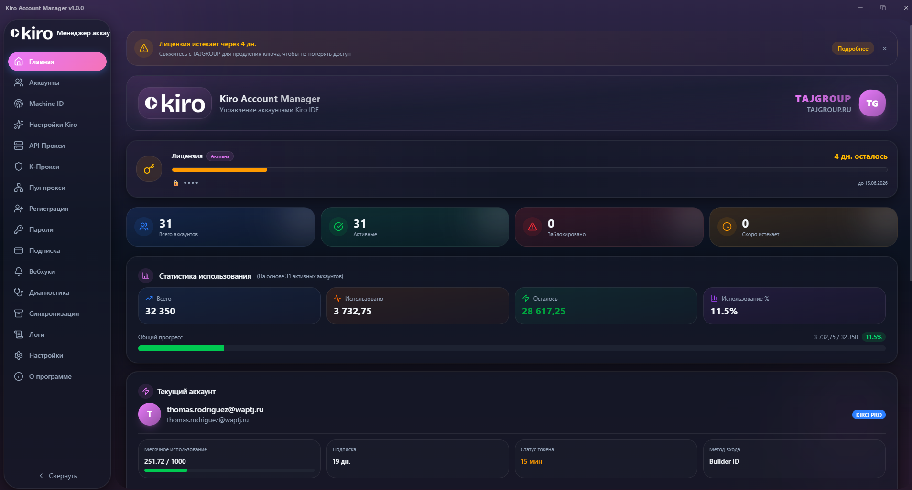
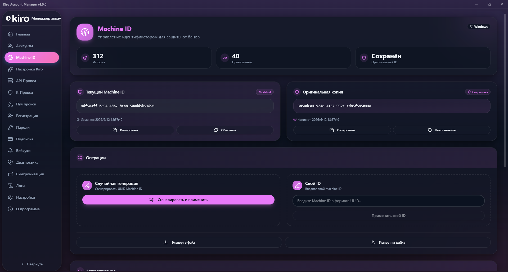
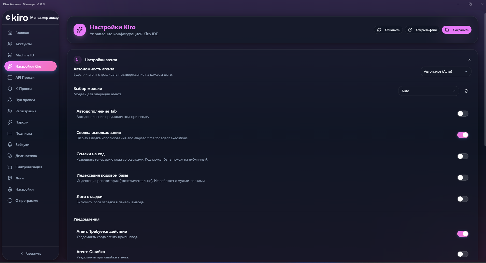
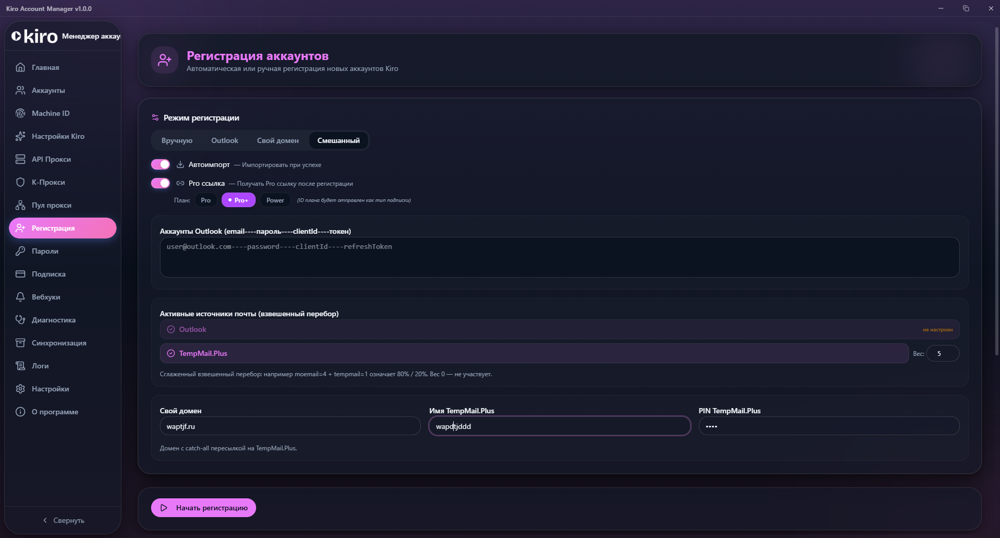

  

  

# 🛡 TAJGROUP Kiro Manager

 

 

[Канал](https://t.me/tajgroup_official) · [Группа](https://t.me/tajgroup_chat) · [Поддержка](https://t.me/tajgroup_ru) · [Получить ключ](https://t.me/tajgroupkirobot)

 

**🇷🇺 Русский** | [🇬🇧 English](#-english) | [🇹🇯 Тоҷикӣ](#-тоҷикӣ)

---

 

## 🇷🇺 Русский

### 📸 Скриншоты

#### Главная панель

> Статистика аккаунтов, лицензия, использование и текущий аккаунт.

<!-- Перетащи скриншот home.png сюда -->

 

#### Machine ID

> Управление идентификатором устройства для защиты от банов.

<!-- Перетащи скриншот machineid.png сюда -->

 

#### Настройки Kiro

> Конфигурация Kiro IDE — агент, модели, уведомления.

<!-- Перетащи скриншот settings.png сюда -->

 

#### Регистрация

> Автоматическая и ручная регистрация аккаунтов Kiro.

<!-- Перетащи скриншот registration.png сюда -->

 

### ✨ Возможности

<table>
<tr>
<td width="50%">

**🔐 Мультиаккаунт**
Управление несколькими аккаунтами, переключение в один клик.

**🔄 Автообновление токенов**
Токены обновляются автоматически до истечения.

**🔑 Machine ID**
Защита от банов по устройству.

**⚡ Автопереключение**
Смена аккаунта при низком балансе.

**📁 Группы и теги**
Организация аккаунтов по группам и тегам.

</td>
<td width="50%">

**🌐 API Прокси**
OpenAI и Claude совместимые эндпоинты.

**🛡 Безопасность**
Шифрование, IP фильтрация, API ключи, TLS.

**🎨 32 темы**
Тёмный и светлый режим.

**📊 Аналитика**
Статистика, графики, экспорт CSV.

**🚀 Регистрация аккаунтов**
Автоматическое создание с поддержкой прокси.

</td>
</tr>
</table>

 

### 📥 Установка

#### Шаг 1 — Получите ключ (бесплатно)

1. Подпишитесь на [канал](https://t.me/tajgroup_official) и вступите в [группу](https://t.me/tajgroup_chat)
2. Откройте бота [@tajgroupkirobot](https://t.me/tajgroupkirobot)
3. Нажмите «🔑 Получить ключ»
4. Скопируйте ключ

#### Шаг 2 — Установите

1. [Скачайте установщик](https://github.com/Khudoidod-dev/TAJGROUP-Kiro-Manager/releases/latest)
2. Запустите `TAJGROUP-Kiro-Manager-1.0.0-setup.exe`
3. Следуйте инструкциям

#### Шаг 3 — Активируйте

1. Запустите приложение
2. Введите ключ
3. Готово! ✨

 

### 🔑 Лицензия

| | |
|:--|:--|
| ⏱ Срок ключа | 10 дней |
| 🔄 Продление | Бесплатно (пока подписаны) |
| 🎁 Реферальный бонус | +3 дня обоим |
| 🔒 Отписка | Ключ блокируется |
| 💻 Привязка | 1 ключ = 1 устройство |

> 💡 **Пригласите друга** — оба получите +3 дня!

 

### ❓ Вопросы

<b>Как получить ключ?</b>

 Подпишитесь на канал и группу, затем напишите боту @tajgroupkirobot.

<b>Ключ истёк — что делать?</b>

 Нажмите «Получить ключ» в боте снова. Подписка должна быть активна.

<b>«Ключ заблокирован» — что это?</b>

 Вы отписались от канала или группы. Подпишитесь снова и получите новый ключ.

<b>Можно на нескольких ПК?</b>

 Нет, ключ привязывается к одному устройству.

 

---

 

## 🇬🇧 English

### ✨ Features

<table>
<tr>
<td width="50%">

**🔐 Multi-Account Management**
Manage multiple Kiro IDE accounts with one-click switching.

**🔄 Auto Token Refresh**
Tokens refresh automatically before expiration.

**🔑 Machine ID Protection**
Prevent account bans with unique device identifiers.

**⚡ Auto-Switch**
Automatically switch when balance is low.

</td>
<td width="50%">

**🌐 API Proxy Server**
OpenAI & Claude compatible endpoints.

**🛡 Security**
Encryption, IP filtering, API keys, TLS.

**🎨 32 Themes**
Dark and light mode with full customization.

**📊 Analytics**
Usage statistics, graphs, CSV export.

</td>
</tr>
</table>

 

### 📥 Installation

1. Subscribe to [Channel](https://t.me/tajgroup_official) and join [Group](https://t.me/tajgroup_chat)
2. Open bot [@tajgroupkirobot](https://t.me/tajgroupkirobot) → press "🔑 Get Key"
3. [Download installer](https://github.com/Khudoidod-dev/TAJGROUP-Kiro-Manager/releases/latest)
4. Install and enter the key → Done! ✨

 

### 🔑 License

| | |
|:--|:--|
| ⏱ Duration | 10 days |
| 🔄 Renewal | Free (while subscribed) |
| 🎁 Referral | +3 days for both |
| 🔒 Unsubscribe | Key gets blocked |
| 💻 Binding | 1 key = 1 device |

> 💡 **Invite a friend** — both get +3 days!

 

---

 

## 🇹🇯 Тоҷикӣ

### ✨ Имконият

<table>
<tr>
<td width="50%">

**🔐 Идоракунии аккаунтҳо**
Идоракунии якчанд аккаунти Kiro IDE бо як клик.

**🔄 Навсозии автоматикии токен**
Токенҳо пеш аз тамомшавӣ автоматикӣ нав мешаванд.

**🔑 Ҳифзи Machine ID**
Пешгирии бан бо идентификатори дастгоҳ.

**⚡ Иваз шудани автоматикӣ**
Ҳангоми кам шудани баланс аккаунт иваз мешавад.

</td>
<td width="50%">

**🌐 API Прокси**
Эндпоинтҳои мутобиқ бо OpenAI ва Claude.

**🛡 Амният**
Рамзгузорӣ, IP филтр, калидҳои API, TLS.

**🎨 32 мавзӯъ**
Ҳолати торик ва равшан.

**📊 Таҳлил**
Омор, графикҳо, экспорти CSV.

</td>
</tr>
</table>

 

### 📥 Насб кардан

1. Ба [канал](https://t.me/tajgroup_official) обуна шавед ва ба [гурӯҳ](https://t.me/tajgroup_chat) дохил шавед
2. Ботро кушоед [@tajgroupkirobot](https://t.me/tajgroupkirobot) → «🔑 Получить ключ» -ро занед
3. [Установщикро зеркашӣ кунед](https://github.com/Khudoidod-dev/TAJGROUP-Kiro-Manager/releases/latest)
4. Насб кунед ва калидро ворид кунед → Тайёр! ✨

 

### 🔑 Литсензия

| | |
|:--|:--|
| ⏱ Мӯҳлат | 10 рӯз |
| 🔄 Тамдид | Ройгон (то вақте ки обуна ҳастед) |
| 🎁 Реферал | +3 рӯз барои ҳарду |
| 🔒 Лағви обуна | Калид баста мешавад |
| 💻 Пайваст | 1 калид = 1 дастгоҳ |

> 💡 **Дӯстро даъват кунед** — ҳарду +3 рӯз мегиред!

 

---

 

## 🛠 Tech Stack

 

---

 

## 📞 Contacts

| | |
|:--|:--|
| 🌐 **Website** | [tajgroup.ru](https://tajgroup.ru) |
| 📢 **Channel** | [@tajgroup_official](https://t.me/tajgroup_official) |
| 💬 **Group** | [@tajgroup_chat](https://t.me/tajgroup_chat) |
| 🛟 **Support** | [@tajgroup_ru](https://t.me/tajgroup_ru) |
| 🤖 **Bot** | [@tajgroupkirobot](https://t.me/tajgroupkirobot) |

 

---

 

© 2025 TAJGROUP. All rights reserved.

